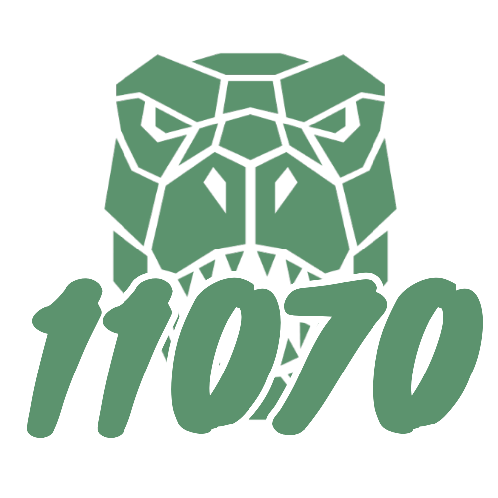
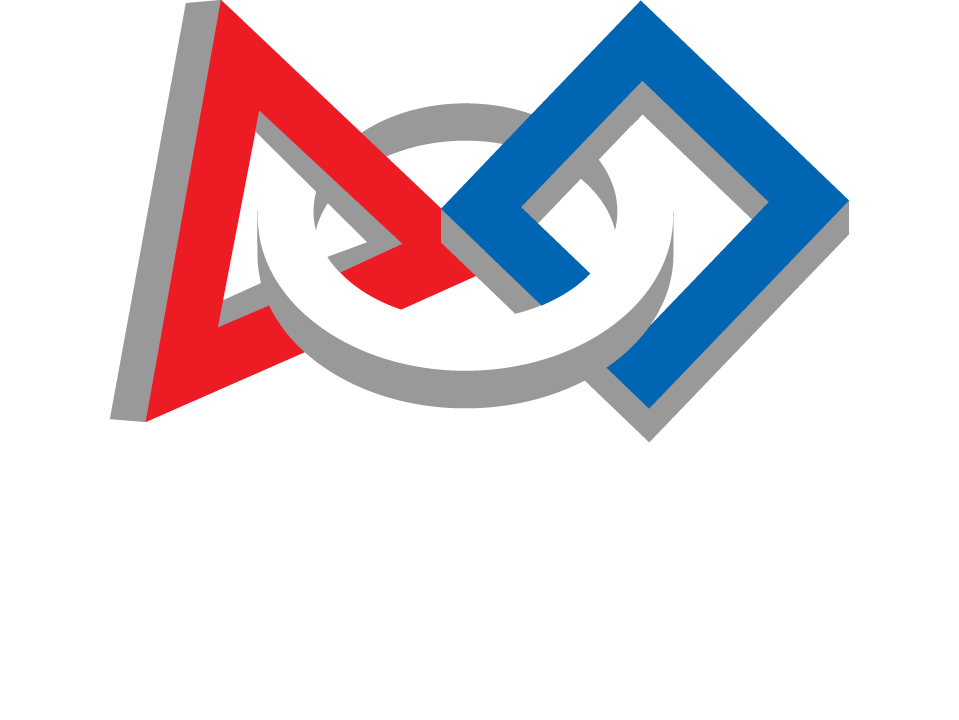

## [Who are we?](https://www.thebluealliance.com/team/11070)

| | |
|---|---|
|  | We are team RoboRex #11070 from the Drom Hasharon Regional Council. Our team was founded on July 1st, 2025, following the closing of the robotics program at the school in the middle of the year, and the initiative was taken to continue engaging in robotics. The team consists of about 40 students from grades 9 to 12, who work together through cooperation, hard work, and a shared desire to learn and develop. A central part of the team's activity is working with the community: exposing students to the world of STEM through activities and workshops that encourage curiosity and interest in science and technology. |

---

## [What is FIRST Robotics?](https://www.firstinspires.org/)

| | |
|---|---|
| FIRST Robotics is a non-profit organization founded by inventor Dean Kamen in 1989 to inspire young people's interest and participation in science and technology. FIRST stands for **For Inspiration and Recognition of Science and Technology**. The organization hosts several robotics competitions each year for students from around the world to demonstrate their engineering and problem-solving skills. |  |